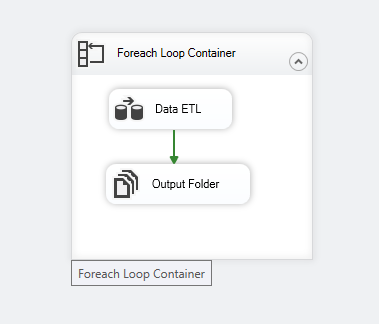
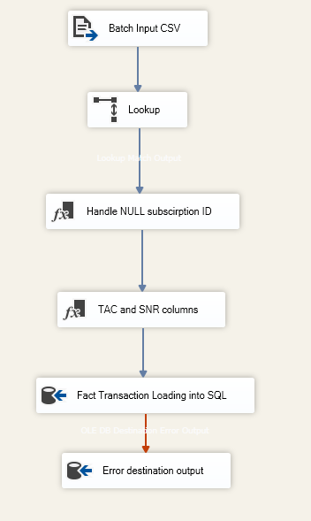
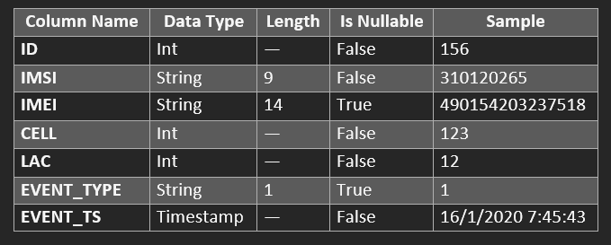
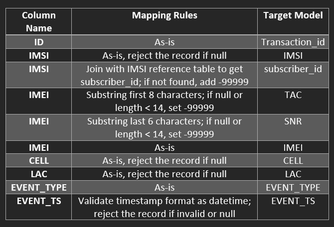
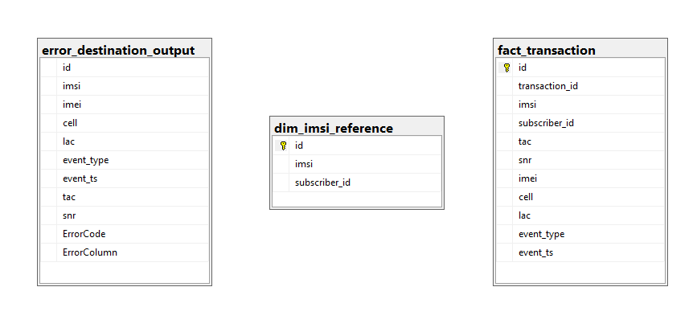

# DEPI SSIS ETL DWH Project

An **SSIS (SQL Server Integration Services)** ETL pipeline that processes telecom CDR (Call Detail Record) data from CSV flat files into a SQL Server data warehouse.

## 🏗️ Architecture

### Control Flow

The package uses a **Foreach Loop Container** that iterates over all CSV files in the source directory, processes them through a Data Flow Task, and writes outputs to the output folder.

<p align="center">
  
</p>

### Data Flow

Inside the Foreach Loop, the Data Flow pipeline reads flat files, performs lookups, handles nulls, derives columns, and loads data into SQL Server — with error handling for failed inserts.

<p align="center">
  
</p>

### Data Flow Summary

1. **Batch Input CSV** — Reads pipe-delimited (`|`) CSV data via Flat File Source
2. **Lookup** — Joins on `imsi` against `dim_imsi_reference` to get `subscriber_id`
3. **Handle NULL subscription ID** — Handles records where the lookup returned no match
4. **TAC and SNR columns** — Derives TAC (first 8 chars) and SNR (last 6 chars) from IMEI
5. **Fact Transaction Loading into SQL** — Inserts valid records into `fact_transaction`
6. **Error destination output** — Redirects failed inserts to `error_destination_output`

## 📊 Source Data Schema

The source CSV files are pipe-delimited with the following column definitions:

<p align="center">
  
</p>

## 🔄 Mapping Rules

Each source column is transformed according to specific mapping rules before loading into the target model:

<p align="center">
  
</p>

## 🗄️ Database Schema

The ETL pipeline uses three tables in `SSIS_Telecom_DB`:

<p align="center">
  
</p>

| Table | Purpose |
|-------|---------|
| `fact_transaction` | Main fact table for telecom CDR transactions |
| `error_destination_output` | Stores records that failed during ETL loading |
| `dim_imsi_reference` | Dimension/lookup table mapping IMSI to subscriber IDs |

## 🚀 Getting Started

### Prerequisites

- **SQL Server Express** (or any SQL Server edition)
- **Visual Studio 2022** with the **SQL Server Integration Services Projects** extension
- **SQL Server Management Studio (SSMS)** (recommended)

### Setup Instructions

1. **Clone the repository**
   ```bash
   git clone https://github.com/Mohammed14906/DEPI-SSIS-ETL-DWH-Project.git
   ```

2. **Create the database and tables**
   ```bash
   # Run the SQL setup script in SSMS or sqlcmd
   sqlcmd -S .\SQLEXPRESS -i SQL/setup_database.sql
   ```

3. **Open the project in Visual Studio**
   - Open `DEPI SSIS ETL DWH Project.slnx`

4. **Update file paths**
   - The package uses absolute paths that need to match your local directory
   - Update the `FullPath` and `Output` variables in the package to match your local directory structure
   - Update the Flat File Connection Manager path and the Foreach Loop Container folder path

5. **Update the database connection**
   - The default connection points to `.\SQLEXPRESS` with Windows Authentication
   - Update the OLE DB Connection Manager if your SQL Server instance name differs

6. **Run the package**
   - Press **F5** or click **Start** in Visual Studio to execute the ETL pipeline

## 📁 Project Structure

```
DEPI SSIS ETL DWH Project/
├── DEPI SSIS ETL DWH Project.slnx     # Solution file
├── Source Files/                        # Input CSV data files
│   ├── 01_clean_data.csv
│   ├── 02_clean_data_with_null.csv
│   ├── 03_sample_data.csv
│   ├── batch_01_file_01.csv ... 05
│   └── batch_02_file_01.csv ... 05
├── Output Files/                        # ETL output directory
├── Images/                              # Documentation images
├── DEPI SSIS ETL DWH Project/          # SSIS project
│   ├── Package.dtsx                     # Main SSIS package
│   ├── DEPI SSIS ETL DWH Project.dtproj
│   ├── DEPI SSIS ETL DWH Project.database
│   └── Project.params
├── SQL/
│   └── setup_database.sql              # Database setup script
├── README.md
└── .gitignore
```

## 📝 License

This project was developed as part of the **DEPI (Digital Egypt Pioneers Initiative)** advanced data engineering track.